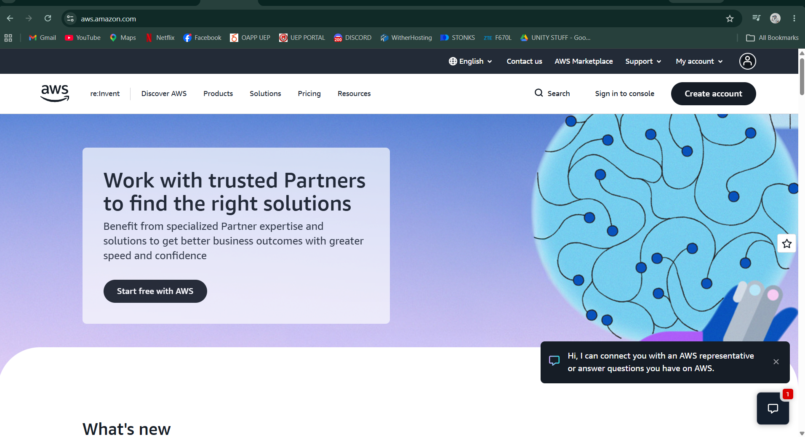

# Amazon Web Services (AWS) - Research Report

## Brief Overview
Amazon Web Services (AWS) is a comprehensive and broadly adopted cloud platform launched by Amazon in 2006. It provides over 200 fully featured services from data centers globally, offering on-demand delivery of compute power, database storage, content delivery, and networking capabilities to help businesses scale efficiently.

## Global Infrastructure
AWS operates an extensive global infrastructure structured into geographic Regions and isolated Availability Zones (AZs).
* **Regions:** Geographic locations containing multiple, physically separated and isolated Availability Zones.
* **Availability Zones:** One or more discrete data centers with redundant power, networking, and connectivity within a Region.
* **Edge Locations:** Over 400+ points of presence worldwide designed for low-latency content delivery via Amazon CloudFront.

## Cloud Management Console
The AWS Management Console is a web-based graphical user interface used to access, manage, and monitor all AWS resources. It features a customizable dashboard, quick service search, and direct access to AWS CloudShell for command-line operations.

## Core Services
1. **Amazon EC2 (Elastic Compute Cloud):** Provides scalable, resizable virtual servers in the cloud for hosting applications.
2. **Amazon S3 (Simple Storage Service):** Offers highly scalable object storage for data backup, archiving, analytics, and static web hosting.
3. **Amazon VPC (Virtual Private Cloud):** Provisions a logically isolated section of the AWS Cloud where resources can be launched in a custom virtual network.
4. **AWS IAM (Identity and Access Management):** Manages access to AWS services and resources securely with fine-grained permissions and roles.

## Advantages
* **Market Leader & Extensive Ecosystem:** Features the most comprehensive selection of services and deepest functionality in the cloud market.
* **Global Footprint:** Massive distribution of global data centers ensuring low latency, high performance, and fault tolerance.
* **Flexible Pricing & Cost Management:** Offers versatile Pay-As-You-Go models, Savings Plans, and Reserved Instances for cost optimization.

## Typical Enterprise Use Cases
* Hosting enterprise web applications and scalable e-commerce platforms.
* Building serverless applications and microservices architectures using AWS Lambda.
* Enterprise data archiving, disaster recovery, and big data analytics pipelines.
