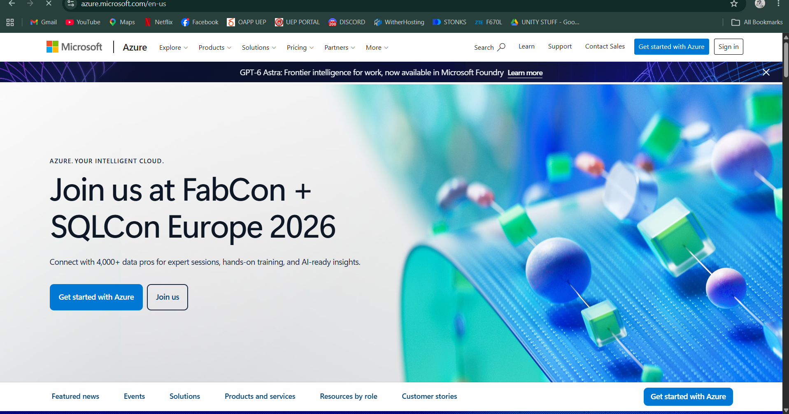

# Microsoft Azure - Research Report

## Brief Overview
Microsoft Azure is a cloud computing service created by Microsoft in 2010. It provides a wide range of cloud services, including compute, analytics, storage, and networking. Azure is particularly recognized for its seamless integration with existing Microsoft enterprise software ecosystems and hybrid cloud capabilities.

## Global Infrastructure
Azure has a massive global presence structured around Regions, Availability Zones, and Geographies.
* **Regions:** Sets of data centers deployed within a latency-defined perimeter and connected through a dedicated region-wide network.
* **Availability Zones:** Unique physical locations within an Azure region equipped with independent power, cooling, and networking.
* **Geographies:** Discrete boundaries containing two or more regions that preserve data residency and compliance boundaries.

## Cloud Management Console
The Azure Portal is a unified, web-based administrative console that allows users to build, manage, and monitor cloud resources ranging from simple web apps to complex cloud deployments. It uses an intuitive blade-based interface for navigation.

## Core Services
1. **Azure Virtual Machines (VMs):** On-demand, scalable compute resources for running Windows or Linux virtual servers.
2. **Azure Blob Storage:** Massively scalable object storage designed for storing unstructured data such as images, documents, and backups.
3. **Azure Virtual Network (VNet):** Enables Azure resources to securely communicate with each other, the internet, and on-premises networks.
4. **Microsoft Entra ID (formerly Azure Active Directory):** Cloud-based identity and access management service for securing user access and directory syncing.

## Advantages
* **Seamless Microsoft Ecosystem Integration:** Unmatched compatibility with Windows Server, SQL Server, Active Directory, and Microsoft 365.
* **Hybrid Cloud Leadership:** Industry-leading hybrid capabilities through Azure Arc and Azure Stack for hybrid deployments.
* **Enterprise Licensing Cost Savings:** Significant cost advantages for existing Microsoft customers through the Azure Hybrid Benefit.

## Typical Enterprise Use Cases
* Migrating on-premises Windows Server and Active Directory environments to the cloud.
* Enterprise hybrid cloud deployments bridging on-premises data centers with public cloud infrastructure.
* Enterprise SQL database hosting and Microsoft Dynamics/ERP solutions.
