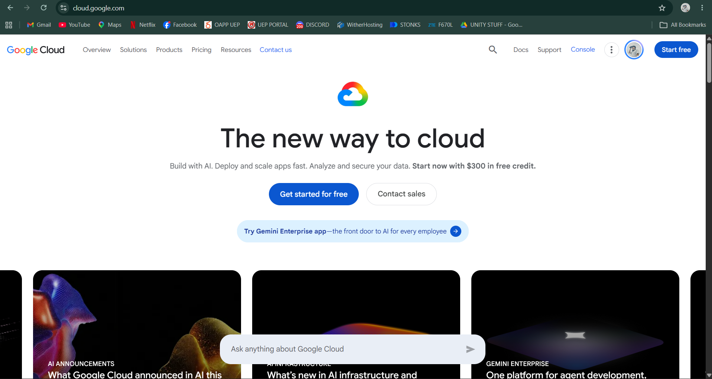

# Google Cloud Platform (GCP) - Research Report

## Brief Overview
Google Cloud Platform (GCP) is a suite of cloud computing services offered by Google, launched in 2008. Built on the same high-performance infrastructure that Google uses internally for products like Google Search and YouTube, GCP excels in big data processing, machine learning, artificial intelligence, and container management.

## Global Infrastructure
GCP’s global network is designed to deliver high throughput and minimal latency across all operations.
* **Regions:** Independent geographic areas comprised of multiple zones.
* **Zones:** Deployment areas within a region representing single failure domains.
* **Global Private Network:** Utilizes Google’s private high-speed global fiber-optic network connecting all data centers directly.

## Cloud Management Console
The Google Cloud Console is an intuitive web-based administrative interface used to deploy, configure, and monitor GCP resources. It includes an integrated Cloud Shell environment accessible directly in the browser.

## Core Services
1. **Google Compute Engine (GCE):** Highly customizable virtual machines running on Google’s infrastructure.
2. **Google Cloud Storage:** Unified object storage for live data access, archival storage, and big data analytics.
3. **VPC (Virtual Private Cloud) Network:** Global private network connecting GCP resources across regions without needing public internet routing.
4. **Google Cloud IAM:** Fine-grained access control and permissions management for GCP project resources.

## Advantages
* **Container & Kubernetes Pioneer:** Native expertise as the original creator of Kubernetes through Google Kubernetes Engine (GKE).
* **Advanced AI and Data Analytics:** Industry-leading tools for machine learning (Vertex AI) and serverless data warehousing (BigQuery).
* **High-Speed Private Backbone Network:** Leverages Google’s private global fiber network for fast and secure data transfers.

## Typical Enterprise Use Cases
* Training and deploying complex Artificial Intelligence and Machine Learning models.
* Real-time big data processing and enterprise data warehousing using BigQuery.
* Containerized microservices applications managed via Kubernetes clusters.
